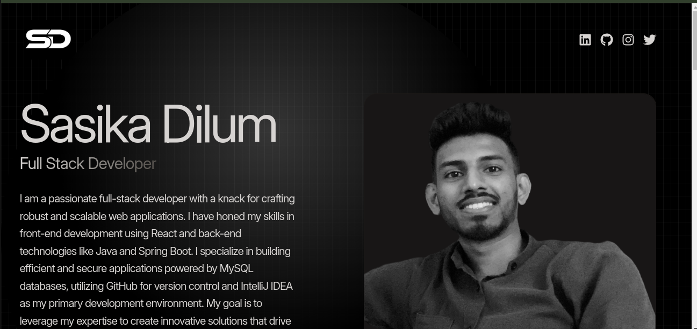

# Sasika Dilum Portforlio Web site
Welcome to my personal portfolio website! This project showcases my skills, projects, and professional journey. Below, you'll find details about the project and how to get started if you'd like to explore or contribute.

---
## Version
0.1.5

### Link Of Site
https://sasika-dilum.vercel.app/


## Features

- **About Me**: A brief introduction about myself, including my background and expertise.
- **Projects**: A gallery of my projects with descriptions, technologies used, and links to live demos or repositories.
- **Skills**: A list of technical and professional skills.
- **Contact Form**: A form for visitors to reach out to me directly.
- **Responsive Design**: The website is fully responsive and works on all devices.

---

## Technologies Used

- **Frontend**: React, JavaScript
- **Build Tool**: Vite
- **Styling**: CSS, [Add any libraries or frameworks like Tailwind CSS, Styled Components, etc.]
- **Deployment**: [Specify hosting platform, e.g., GitHub Pages, Netlify]

---

## Installation

If you'd like to run the project locally, follow these steps:

1. **Clone the Repository**:
   ```bash
   git clone https://github.com/yourusername/portfolio-website.git
   ```

2. **Navigate to the Project Directory**:
   ```bash
   cd portfolio-website
   ```

3. **Install Dependencies**:
   ```bash
   npm install
   ```

4. **Run the Development Server**:
   ```bash
   npm run dev
   ```

5. **Open in Browser**:
   - Visit `http://localhost:5173` to view the website.

---

## Deployment

The website is deployed and live at: https://sasika-dilum.vercel.app/

---

## Screenshots




---


## Feedback and Contributions

Feedback and contributions are welcome! If you encounter any issues or have ideas for improvements, feel free to open an issue or submit a pull request.

---

## Contact

Feel free to reach out to me at:
- **Email**: sasikadilum40@gamil.com
- **LinkedIn**: https://www.linkedin.com/in/sasikad/
- **GitHub**: https://github.com/sasikad1

---

Thank you for visiting my portfolio website! I hope you enjoy exploring it.


